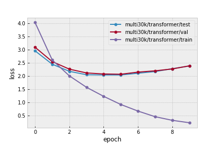
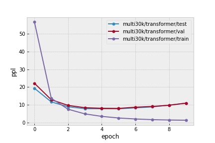
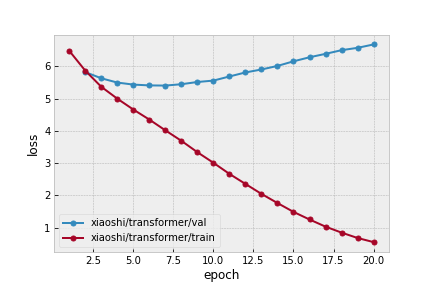
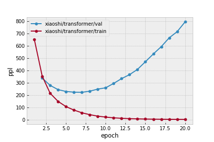

# TorchNMT

## Introduction

A simple implementation of the neural machine translation framework using pytorch.

## Models

- Transformer (https://arxiv.org/abs/1706.03762)

## Datasets

- **Xiaoshi**: A Chinese to Chinese traditional poetry dataset (https://github.com/enhuiz/XiaoShi).

- **Multi30K (En-De)**: WMT'17 Multimodal Translation task (En-De) (https://www.statmt.org/wmt17/multimodal-task.html).

## Example

### Prerequisites

```bash
pip install -r requirements.txt
```

### Train

```bash
python scripts/train.py config/xiaoshi/transformer.yml
```

### Validate

```bash
python scripts/validate.py config/xiaoshi/transformer.yml
```

### Test

```bash
python scripts/test.py config/xiaoshi/transformer.yml
```

## Results

### Multi30k (En-De)

#### Loss & Perplexity





#### Scores

> Evaluation tool: https://github.com/jhclark/multeval

| Model       | BLEU (val/test) | METEOR (val/test) | TER (val/test) |
| ----------- | --------------- | ----------------- | -------------- |
| Transformer | 31.4/32.2       | 48.1/49.2         | 50.9/51.0      |

#### Examples

| En                                                                        | De (Model)                                                        | De (Ground Truth)                                                      |
| ------------------------------------------------------------------------- | ----------------------------------------------------------------- | ---------------------------------------------------------------------- |
| A man in an orange hat starring at something                              | ein mann mit einem orangefarbenen hut starrt auf etwas            | ein mann mit einem orangefarbenen hut der etwas <unk>                  |
| A Boston Terrier is running on lush green grass in front of a white fence | ein fan rennt auf einer grünen wiese vor einem weißen zaun        | ein boston terrier läuft über saftig grünes gras vor einem weißen zaun |
| A girl in karate uniform breaking a stick with a front kick               | ein mädchen in einem karateanzug folgt dem vor einem fußtritt her | ein mädchen in einem karateanzug bricht einen stock mit einem tritt    |

### Xiaoshi (Poetry-Chinese)

#### Loss & Perplexity





#### Scores

| Model       | BLEU | TER   |
| ----------- | ---- | ----- |
| Transformer | 0.8  | 104.3 |

#### Examples

| Poetry                           | Chinese (Model)                                                                                                | Chinese (Ground Truth)                                                                                               |
| -------------------------------- | -------------------------------------------------------------------------------------------------------------- | -------------------------------------------------------------------------------------------------------------------- |
| 繖幄垂垂马踏沙，水长山远路多花。 | 两 岸 青 山 着 波 浪 花 瓣 ， 沿 着 路 上 的 沙 岸 ， 白 云 正 在 长 安 路 上 ， 重 叠 水 中 已 经 过 去 了 。 | 马 后 垂 着 伞 盖 ， 马 蹄 踩 着 黄 沙 ， 沙 沙 ， 沙 沙 。 山 遥 遥 ， 水 茫 茫 ， 沿 路 见 到 那 么 多 的 野 花 。 |
| 眼中形势胸中策，缓步徐行静不哗。 | 池 塘 中 的 忧 愁 绪 纷 纷 纷 杂 ， 就 好 像 想 要 平 盛 世 上 的 音 。                                        | 眼 观 敌 我 形 势 ， 战 术 方 略 早 已 成 竹 在 胸 。 兵 马 缓 步 前 进 ， 三 军 肃 静 无 人 喧 哗 。                |
| 满腹诗书漫古今，频年流落易伤心。 | 两 年 来 ， 流 落 他 们 ， 但 我 的 心 情 愿 在 地 上 ， 流 落 他 依 旧 古 今 年 的 兴 致 都 是 古 今 了 。    | 装 满 一 肚 子 诗 书 ， 博 古 通 今 。 连 年 流 落 他 乡 ， 最 易 伤 情 。                                           |

## Acknowledgement

- https://github.com/jadore801120/attention-is-all-you-need-pytorch
- http://nlp.seas.harvard.edu/2018/04/03/attention.html
- https://github.com/OpenNMT/OpenNMT-py
